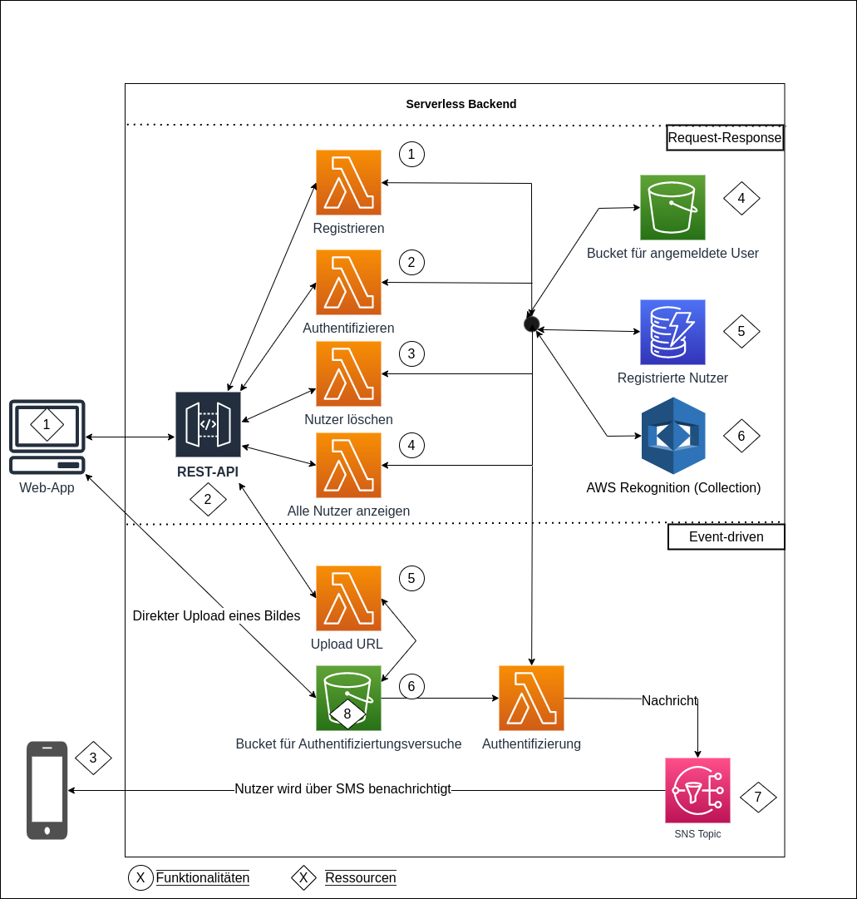

# Projektarbeit Master Digital Business


<h4 align="center">
Umsetzung einer Gesichtserkennungsanwendung mittels Serverless-Computing in AWS
</h4>
<p align="center">

</p>
<h5 align="center">
<br>
Projektarbeit Digital Business Master
<br>
Wintersemester 2022/2023 
<br>
Simon Schwegler (35326) & Oliver Hagel (30306)
<br>
HS Ravensburg Weingarten
<br>
Betreuender Professor: Prof. Dr. rer. nat. Thomas Bayer
</h5>


## Ziel

Das Ziel der vorliegenden Projektarbeit war die Implementierung eines serverlosen Backends zur automatisierten Gesichtserkennung.
Ein User soll hierbei die Möglichkeit haben sich zu registieren, anzumelden oder seinen Account zu löschen.
Die Authentifizierung sollte einerseits als klassischer REST-API Endpunkt realisiert werden (Request-Response).
Andererseit sollte zusätzlich ein Event-Driven Ansatz über eine Benachrichtigung implementiert werden. 
Die Anwendung soll mittels AWS SAM und den damit verbundenen AWS-Diensten realisiert werden. Hierbei steht insbesondere der Dienst
AWS Rekognition, zur Gesichtserkennung, im Fokus.

## Architektur

Die folgende Abbildung zeigt die Architektur des Projektes:

<p align="center">

</p>

Im folgenden erfolgt eine genauere Beschreibung der verwendeten Ressourcen und Funktionalitäten:

### 1.Ressourcen #

1.1 **Web-APP**:
Der Fokus der Arbeit liegt auf der Implementierung des Backend. Dennoch wurde im Zuge der Realisierung des Projektes eine Web-Anwendung implementiert (REACT.JS).
Hierdurch können die implementierten Funktionalitäten des Backends einfacher getestet werden. Die Kommunikation erfolgt über HTTP. Das Frontent wurde in das SAM Template aufgenommen 
und mittels ***AWS Amplify*** deployed 

1.2 **REST-API**:
Damit die angebotenen Dienste öffentlich zugänglich sind und somit auch vom Frontend aufgerufen werden können, wird eine REST-API benötigt. 
Diese wird über den AWS Dienst ***Amazon API Gateway*** realisiert. Der Dienst wird mit ***Lambda Funktionen*** integriert, so dass jeder angebotene Endpunkt mit genau einer Funktion verbunden ist.

1.3 **Smartphone**: Damit ein Nutzer bei der Event-basierten Authentifizierung über das Ergebnis der Authentifizierung benachrichtigt wird, 
wird ein Smartphone benötigt. 

1.4 **S3 Bucket**: Dieser Bucket dient zur Ablage der hochgeladenen Bilder der registrierten Nutzer. Jedes Bild hat eine eindeutige URL und kann daher direkt vom 
Frontend bezogen werden.

1.5 **DynamoDB**: Es wird eine DynamoDB Tabelle benötigt. Diese speichert neben den angesprochenen Bild-Urls weitere Informationen zu einem Nutzer ab.

1.6 **AWS Rekognition**: Das Herzstück der Anwendung stellt dieser Service dar. Dieser Dienst stellt zahlreiche Funktionalitäten für die Bildanalyse bereit.
Im Hintergrund werden sämtliche Informationen eines erkannten Gesichtes in einer sogennanten Collection gespeichert [[1]](#1). 

1.7 **SNS Topic**: Das Topic dient in der Anwendung zur Benachrichtigung eines Nutzers über das Authentifizierungsergebnises über eine SMS.

1.8 **S3 Bucket**: Der zweite Bucket dient für die Event-basierte Authentifizierung, indem der Client direkt ein Bild in den Bucket lädt, welches im Folgenden
analysiert werden soll.


### 2. Funktionalitäten #

Sämtliche hier vorgestellten Implementierungen basieren auf einer Referenzarchitektur für Gesichtverifizierung innerhalb des AWS Ökosystens [[1]](#1) [[3]](#3).
Dennoch wurden Anpassungen getätigt. Als Beispiel wird auf die Verwendung von **Step Functions** verzichtet. 

2.1 **Registrieren**: 

Die zugehörige **Lambda Funktion** extrahiert aus dem übergebenen Http-Request-Body das Bild sowie weitere Nutzerinformationen.
Das Bild wird im Anschluss validiert. Hierbei wird überpürft, ob genau ein Gesicht in einer gewünschten Qualität vorhanden ist. 
Andernfalls kommt es zu einem Fehler. ***Diese Überprüfung wird bei allen weiteren Funktionen getätigt.*** 
AWS Rekognition bietet hierfür die Funktion **detectFaces** an. 
Diese Funktion extrahiert die zentralen Gesichtszüge einer Person (Augen, Nase und Mund) [[2]](#2).
Nach der Validierung erfolgt eine Überprüfung, ob der Nutzer bereits angemeldet ist. Hierfür dient die Funktion
**searchFacesByImage** [[4]](#4). Konkret wird analysiert, ob bereits ein FaceVector des Nutzers in der Collection vorhanden ist.
Ist das nicht der Fall, kann ein neuer Nutzer erstellt werden. Hierfür wird die Funktion **indexFaces** mit dem Bild aufgerufen.
Diese Funktion erkennt innerhalb eines Bildes Gesichter und extrahiert aus den Gesichtszügen einen **feature vektor** und speichert diesen intern innerhalb einer Collection ab 
[[5]](#5). Bei diesem Vorgang wird die Userid (wird über das Frontend mitgegeben) dem Aufruf mitgegeben.
Diese Id wird hierbei dem gespeichterten Gesicht angehangen. Dies ist für die nachfolgende Authentifizierung wichtig.
Im Anschluss wird das Bild noch in ein S3 Bucket abgelegt. 
Zudem werden die mitgegebenen Nutzerinformationen in eine DynamoDB Tabelle geschrieben. Darunter befindet sich auch eine FaceId des gespeicherten Gesichts in der Rekogntion Collection.
Der Client wird über den Statuscode 200 darüber informiert, dass die Registrierung erfolgreich war.

2.2 **Authentifizieren (REST)**:

Erfolgt die Authentifizierung über REST, kann der Client direkt nach der Verarbeitung über das Ergebnis benachrichtigt werden.
Daher wird über den Body ein Bild an das Backend gesendet. Die zugehörige Funktion validiert im Anschluss das Bild.
Ist dieses gültig, wird die **Rekognition-Funktion searchFacesByImage** aufgerufen. Hierbei wird das Bild mit Face-Vektoren der Collection abgeglichen.
Gibt es ein Gesicht, das mindestens 90% Änhlichkeit zu dem Nutzer aufweist, gilt der Nutzer als erkannt.
Da bei der Erstellung des Vektors (indexFaces) zuvor eine UserId an den Vektor angebracht wurde, kann diese Id im Anschluss bei einem Match wieder entnommen werden.
Über diese extrahierte UserId kann im Anschluss auf die Datenbank zugegriffen werden.
Somit wird bei einer erfolgreichen Anmeldung zusätzlich noch der erkannte Nutzer an den Client zurückgegeben. 

2.3 **Nutzer löschen**:

Soll ein Nutzer gelöscht werden, erfolgt dies über das Mitsenden der UserId. 
Die Nutzerdaten werden im Anschluss aus der Datenbanktabelle geladen. Darunter befindet sich neben einer FaceId, auch eine Referenz auf das abgelegte Bild eines 
Nutzers in einem S3 Bucket. Somit kann der Datenbankeintrag, das Bild aus dem Bucket sowie das indizierte Gesicht gelöscht werden.
Für den letzten Schritt bietet AWS Rekogntion die Funktion **deleteFaces** an. Hierbei wird die FaceId aus der Datenbank dem Aufruf mitgegeben [[6]](#6).

2.4 **Alle Nutzer anzeigen**:

Über einen AdminView können im Frontend alle registrierten Nutzer angezeigt werden. Im Backend genügt hierfür ein Zugriff auf die Datenbanktabelle.
Weitere Services werden nicht benötigt.


#### Im folgenden wird der Event-basierte Ansatz der Authentifizierung thematisiert:

2.5 **Anfrage zum direkten Upload in ein Bucket**:

Hierbei erfolgt eine Authentifizierung nach dem Upload in ein S3-Bucket. Der Upload kann hierbei nicht direkt vom Client erfolgen.
Dieser muss sich zuvor über einen REST-Endpunkt eine Upload-Url beschaffen [[7]](#7). Zwar wäre ein direkter Upload ohne diesen Zwischenschritt auch möglich, 
jedoch müsste jeder Client hierfür AWS Libaries bereitstellen. Dies wurde zu einer stärkeren Kopplung zum AWS Backend führen. <br>
Daher fragt der Client vor dem eigentlichen Upload bei Backend an. Eine Lambda Funktion erzeugt daraufhin einen temporär gültigen Upload-Link für ein Bild.
Dieser Link wird zurück an den Client geschickt. Grundlage hierfür ist die AWS Function **createPresignedPost* [[8]](#8).
Über diesen Link kann dann das Bild direkt in das S3-Bucket geladen werden.

2.6 **Authentifizierung (Event-basiert)**:

Wird ein Bild in das Bucket geladen, wird ein Event ausgelöst, welches die Ausführung einer Lambda Funktion triggert.
Das Event wurde zuvor wiefolgt registriert:

```
ImageUploadedEvent:
Type: S3
Properties:
Bucket: !Ref S3AuthAttemptBucket
Events: s3:ObjectCreated:*
```

Anders als bei der Anmeldung über REST, wird ein S3 Event der Funktion übergeben. Diese Event beinhaltet eine Referenz auf den S3-Bucket
sowie auf die hochgeladene Datei. Nach der Überprüfung des Bildes, erfolgt auch hier der Aufruf der **Rekognition-Funktion searchFacesByImage** (siehe 2.2).
Nachdem das Ergebnis feststeht, ob der Nutzer vorhanden ist oder nicht, wird zu einem **SNS Topic** eine Nachricht veröffentlicht.
Das Topic ist folgendermaßen konfiguriert.

````
  AuthResultTopic:
    Type: "AWS::SNS::Topic"
    Properties:
      TopicName: !Join ["-", [AuthResultTopic, !Ref AWS::StackName]]
      Subscription:
        - Protocol: sms
          Endpoint: !Ref PhoneNumber

````

Als Subscription ist hierbei der Typ SMS hinterlegt. So wird die Nachricht an die angegebene Telefonnummer geschickt. 
Da sich das Projekt nach dem Deployment immer erst in der SMS-Sandbox befindet, wird die SMS nur an die Nummer versendet, die beim Deployment des SAM Projektes angegeben wurde (siehe [[10]](#phone)).
Die SMS sieht folgendermaßen aus:

<p align="center">

</p>


## Demoversion

Demo-Version:

https://main.dl3jjjbkssvqc.amplifyapp.com/


# Deployment

## Vorraussetzungen

Um SAM lokal ausführend zu können, wird die AWS CLI benötigt. Daher muss diese installiert werden.

https://docs.aws.amazon.com/cli/latest/userguide/install-cliv2-windows.html

Zudem muss die SAM CLI installiert sein:

https://docs.aws.amazon.com/serverless-application-model/latest/developerguide/serverless-sam-cli-install.html

Im Anschluss muss die lokale Entwicklungsumgebung noch mit einem AWS-Account verknüpft werden:

```
aws configure
```

Folgende Konfigurationen werden vorgenommen:

AWS Access Key ID: <Ihr AWS Access Key> <br>
AWS Secret Access Key: <Ihr Secret> <br>
Default region name: eu-central-1 <br>
Default output format. json <br>

## Vorgehen für das Deployment

Bevor der Anwendungsstack deployed werden kann, müssen sämtliche Abhängigkeiten installiert werden.
Werden diese nicht installiert, stehen einzelne Funktionen des serverlosen Backends nicht zur Verfügung, da bei der Ausführung Fehler entstehen. Dies betrifft alle Funktionen, die eine eigene package.json besitzen und daher NPM-Module nutzen.
Hierfür muss NodeJS installiert sein (https://nodejs.org/en/).

Der Build wird über folgenden Befehl ausgeführt:

```
sam build
```

Nach einem Build kann das Backend in die AWS-Cloud deployed werden.


## Deployment

Initiales Deployment:

Ein initiales Deployment wird über folgenden Befehl gestartet:

```
sam deploy -g
```

Hierbei werden Parameter durch den Nutzer an den zu erzeugenden Stack mitgegeben:

Innerhalb des Projektes werden innerhalb der samconfig.toml alle übergebenen Parameter gespeichert und bei einem weiteren Deployment ausgelesen.

Die Parameter werden im Folgenden beschrieben:

- PhoneNumber: Handynummer zum Empfangen des Authentifizierungsergebnises. Da da Projekt nur innerhalb einer Sandbox ausgeführt wird, muss die angegebene Nummer im Anschluss noch verifiziert werden (siehe [[10]](#phone).)
- DeployWithAmplify: true/false - Soll das Frontend über Amplify deployed werden. Ist dem so, müssen gültige Parameter für die nachfolgenden Parameter angegeben werden. Wenn kein Token oder kein Github-Repositorium vorliegt, muss hierbei false angegeben  
  werden.
- GithubRepository: Link zu einem hinterlegten GitHub-Repositorium. Dieses muss dieses Projekt enthalten (Frontend + Backend).
  Das Repositorium wird für das Hosting mittels AWS Amplfify benötigt. Wird nur benötigt wenn DeployWithAmplify auf 'true' gesetzt wird.
- PersonalAcessToken: Token für den Zugriff von auf das Github-Repo - Muss angegeben werden, wenn das Frontend deployed werden soll.
- Branch: Github-Repo Branch des Frontend, der deployed werden soll - Wird nur benötigt wenn DeployWithAmplify auf 'true' gesetzt wird.

Alle weiteren Konfigurationen können mit 'yes' oder mit mit dem Default konfiguriert werden.
Wird das Frontend nicht über Amplify deployed ( DeployWithAmplify=false), können die letzten oben genannten drei Parameter einfach ignoriert oder mit einem beliebigen Wert konfiguriert werden.

Token kann wie folgt erzeugt werden:
https://docs.github.com/en/github/authenticating-to-github/keeping-your-account-and-data-secure/creating-a-personal-access-token

Sollten im Anschluss Änderungen gemacht werden, startet folgender Befehl das Deployment:

```
sam deploy
```

Hierbei müssen die Parameter nicht ein zweites Mal übergeben werden.

## Bereitstellen des Frontends 

Das Frontend lässt sich nach dem Deployment des serverlosen Backends lokal ausführen.
Informationen für die lokale Ausführung befinden sich innerhalb der README.md des Frontend (/client)

Wird das Frontend über Amplify deployed, müssen noch drei Befehle ausgeführt werden. Diese können dem Output nach einem erfolgreichen Deployment entnommen werden.

Alterativ kann folgender Befehl ausgeführt werden, um die Befehle zu erhalten:

```
aws cloudformation describe-stacks --stack-name <Name des Stacks>
```

Bei der Ausführung der folgenden Commands sollte darauf geachtet werden, dass diese innerhalb einer Zeile ausgeführt werden. Beim Kopieren können unerwünschte Zeilenumbrüche entstehen, sodass nur ein Teil eines Commands ausgeführt wird.
Daher gegebenenfalls den generierten Command vor der Ausführung noch formatieren.

Die Commands werden für jeden Stack inital erzeugt und werden dem Output nach einem Deployment entnommen. Entprechend wird eine 1:1-Ausführung der Beispiels-Commands nicht funktionieren.

1. Cors-Header der erstellten Http API konfigurieren. Der auszuführende Command kann dem SAM-Output entnommen werden.

Format des Commands:

```
aws apigatewayv2 update-api --api-id 8aco6poc6c --cors-configuration AllowOrigins=https://main.d3ovku2thzo8rv.amplifyapp.com,http://localhost:8080
```

2. Entwicklungsvaribalen für das Frontend anpassen. Form des Commands:

```
aws amplify update-app --app-id do68bi531l99o --environment-variables VUE_APP_API_ROOT=cogtest,VUE_APP_REGION=eu-central-1,VUE_APP_USER_POOL_ID=eu-central-1_QI3YWvRUC,VUE_APP_CLIENT_ID=3rcu02qt5umvvqp898e0d1e6s6,VUE_APP_URL=https://cogtest-457908813616.auth.eu-central-1.amazoncognito.com
```

Diese Vorgehensweise ist nur bei einem intitalen Deployment nötig. Im Anschluss wird nach jeder Änderung des hinterlegten Git-Repos das Deployment automatisch durch Amplify gestartet.

3. Build und Deploy des Frontend im Anschluss starten

Form:

```
aws amplify start-job --app-id <MyAmplifyAppId> --branch-name <BranchName> --job-type RELEASE
```

Der benötigte Befehl kann auch dem Output innerhalb der Konsole entnommen werden.


## <a id="phone">Telefonnummer verifizieren<a/>

Da sich das Projekt nach dem Deployment immer erst in der SMS-Sandbox befindet, wird die SMS nur an die Nummer versendet, die beim Deployment des SAM Projektes angegeben wurde.
Dennoch ist eine zusätzliche manuelle Registierung der Nummer nötig.

1. In der AWS Console AWS SNS suchen
2. In der Sidebar auf Themen klicken
3. Topic des deployten Stacks auswählen
4. Unter Abonnement auf den zugehörigen Button **Abonnement erstellen** klicken
5. Als Protokoll **SMS** wählen
6. Nummer eingeben und bestätigen


## Anwendungsstack löschen

Soll die Anwendung gelöscht werden, muss dies über die AWS Management Console erfolgen. Hierbei muss der Dienst CloudFormation geöffnet werden.
Innerhalb einer Übersicht aller vorhandener Stacks kann hierbei der zu löschende Stack markiert und gelöscht werden.


# Literaturverzeichnis


<a id="1">[1]</a>
https://aws.amazon.com/de/blogs/machine-learning/identity-verification-using-amazon-rekognition/


<a id="2">[2]</a>
https://docs.aws.amazon.com/rekognition/latest/dg/faces-detect-images.html

<a id="3">[3]</a>
https://aws.amazon.com/de/blogs/machine-learning/build-your-own-face-recognition-service-using-amazon-rekognition/

<a id="4">[4]</a>
https://docs.aws.amazon.com/rekognition/latest/APIReference/API_SearchFacesByImage.html

<a id="5">[5]</a>
https://docs.aws.amazon.com/rekognition/latest/APIReference/API_IndexFaces.html

<a id="6">[6]</a>
https://docs.aws.amazon.com/rekognition/latest/dg/delete-faces-procedure.html

<a id="7">[7]</a>
https://aws.amazon.com/de/blogs/compute/uploading-to-amazon-s3-directly-from-a-web-or-mobile-application/

<a id="8">[8]</a>
https://advancedweb.hu/how-to-use-s3-post-signed-urls/